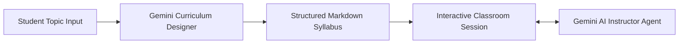

# 📖 EduGPT - Your AI Instructor

EduGPT is an intelligent, interactive AI teaching assistant powered by the **Google Gemini API** (`google-genai` SDK).

Instead of generic single-prompt answers, EduGPT generates an in-depth, structured course syllabus for any topic you want to learn, and assigns a dedicated **AI Instructor** to guide, quiz, and teach you step-by-step in an interactive web classroom.

---

## ⚡ Quick Start (Run Instantly)

If this repository already has the `venv` folder set up, launch the application in **one command**:

### On Windows (PowerShell):
```powershell
.\venv\Scripts\python.exe src/server.py
```

### On Linux / macOS:
```bash
./venv/bin/python src/server.py
```

Now open your web browser and navigate to:
👉 **[http://127.0.0.1:8000](http://127.0.0.1:8000)**

*(Ensure your `.env` file contains your `GEMINI_API_KEY`)*

---

## 🏗️ Architecture & How It Works

EduGPT combines an asynchronous **FastAPI** backend with Google's state-of-the-art **Gemini Flash** models:



1. **Curriculum Synthesis**:
   - The user inputs any learning topic (e.g., *"C Programming"*, *"System Architecture"*, or *"Quantum Computing"*).
   - The curriculum generator queries **Gemini** to construct a 3-module syllabus complete with prerequisites, theory, practical code exercises, and capstone projects.
2. **Stateful Interactive Classroom**:
   - The student interacts with the **AI Instructor Agent** in the classroom arena.
   - Built on Gemini's stateful **Interactions API** using `previous_interaction_id`, the agent maintains seamless contextual memory across the conversation.
3. **Resilient Multi-Model Cascade**:
   - To prevent rate-limit interruptions (HTTP 429) on free-tier API keys, EduGPT implements an automated model cascade:
     $$\text{gemini-3.6-flash} \longrightarrow \text{gemini-3.5-flash-lite} \longrightarrow \text{gemini-3.8-flash}$$
   - If a quota threshold is reached, the next available model seamlessly answers without interrupting your study flow.
4. **Intelligent Fallback Engine**:
   - In case of offline usage or complete network outage, an offline curriculum engine activates automatically so learning never stops.

---

## ✨ Key Features

- 🧠 **Google Gemini Powered**: Official `google-genai` SDK implementation utilizing the high-speed, cost-effective Gemini Flash series.
- 🎨 **Obsidian Glassmorphism UI**: Modern dark-mode interface built with semantic HTML5, modern CSS3, and vanilla JavaScript (ES6+).
- 🗺️ **Interactive Course Roadmap**: Left sidebar roadmap featuring module progress tracking, dynamic topic switching, and completion checkboxes.
- 💬 **Real-Time Interactive Classroom**: Line-by-line concept breakdown, instant code reviews, diagnostic quizzes, and real-world analogies.
- 🔄 **Multi-Turn Contextual Memory**: Remembers previous questions and student answers throughout the session.
- ⚡ **High-Performance FastAPI**: Asynchronous request handling with non-blocking threads for LLM calls.
- 📋 **One-Click Export**: Easily copy the generated syllabus as Markdown or export it as a `.md` file.

---

## 🔑 Environment Configuration (`.env`)

Create or update the `.env` file in the **project root directory** (`EduGPT-main/`):

```env
GEMINI_API_KEY=AIzaSy...your-gemini-api-key-here
MODEL_NAME=gemini-3.6-flash
```

> [!TIP]
> **Getting an API Key**:
> You can generate a free Google Gemini API key at [Google AI Studio](https://aistudio.google.com/app/apikey).

---

## 💻 How to Run the Application

### Option 1: Modern Web Application (Recommended)

This is the primary full-featured web interface:

```powershell
# Run directly with venv Python
.\venv\Scripts\python.exe src/server.py
```

Open your browser at: **[http://127.0.0.1:8000](http://127.0.0.1:8000)**

#### 🎮 Using the Web App:
1. **Course Studio Tab**:
   - Enter any topic (e.g. *Data Structures & Algorithms*, *Rust Programming*, *DevOps Pipelines*).
   - Click **Generate Syllabus**.
   - Review your personalized course roadmap, copy or download the markdown.
2. **Interactive Classroom Tab**:
   - Switch to the Classroom tab to start your lesson.
   - Use the prompt chips (*"Start Module 1"*, *"Real-World Example"*, *"Quiz Me"*, *"Summarize Key Points"*) or type custom questions.
   - Check off modules as you complete them to track your learning progress.

---

### Option 2: Classic Gradio Interface

If you wish to test via the legacy Gradio prototype:

```powershell
.\venv\Scripts\python.exe src/run.py
```
- **Local URL**: `http://127.0.0.1:7860`

---

## 🔌 REST API Endpoints

The FastAPI backend (`src/server.py`) provides clean RESTful endpoints:

| Endpoint | Method | Description |
| :--- | :---: | :--- |
| `/` | `GET` | Serves the single-page web application |
| `/api/status` | `GET` | Returns system status, configured model, and masked API key info |
| `/api/generate-syllabus` | `POST` | Generates a course syllabus using Gemini for `{ "topic": "..." }` |
| `/api/chat` | `POST` | Communicates with the AI Instructor Agent for `{ "message": "..." }` |
| `/api/reset` | `POST` | Clears conversation history and interaction state |
| `/api/settings` | `POST` | Dynamically updates API key, model, or demo mode settings |

---

## 📂 Project Structure

```text
EduGPT/
├── .env                       # Environment variables (GEMINI_API_KEY, MODEL_NAME)
├── .gitignore                 # Git ignore configuration
├── LICENSE                    # MIT License
├── README.md                  # Project documentation
├── diagram.png                # Architecture diagram
├── pyproject.toml             # Project build configuration
├── requirements.txt           # Python dependencies (google-genai, fastapi, uvicorn)
├── setup.py                   # Package setup script
├── src/
│   ├── generating_syllabus.py # Gemini-powered curriculum generation engine
│   ├── run.py                 # Gradio user interface
│   ├── server.py              # FastAPI server & REST API endpoints
│   └── teaching_agent.py      # Multi-turn Gemini AI Instructor agent
└── static/
    ├── app.js                 # Client-side state, chat handler, and Markdown renderer
    ├── index.html             # Semantic HTML5 single-page application
    └── style.css              # Obsidian dark theme and responsive glassmorphism styles
```

---

## 🛠️ Fresh Installation (New Machine Setup)

If you are setting up this repository on a new computer without an existing `venv`:

### 1. Clone the Repository
```bash
git clone https://github.com/Coder-o-cloud/EducationAI.git
cd EduGPT-main
```

### 2. Create Virtual Environment
```powershell
python -m venv venv
```

### 3. Activate Virtual Environment
- **Windows (PowerShell):**
  ```powershell
  .\venv\Scripts\Activate.ps1
  ```
- **Linux / macOS:**
  ```bash
  source venv/bin/activate
  ```

### 4. Install Dependencies
```bash
pip install --upgrade pip
pip install -r requirements.txt
```

---

## ❓ Troubleshooting & FAQs

#### 1. `Error: Port 8000 is already in use`
- **Reason**: An existing Uvicorn or Python process is still bound to port 8000.
- **Solution**: Terminate the previous process in PowerShell:
  ```powershell
  Stop-Process -Name python -Force -ErrorAction SilentlyContinue
  .\venv\Scripts\python.exe src/server.py
  ```

#### 2. `Quota exceeded / Rate Limit (Error 429)`
- **Reason**: Free-tier Gemini API keys have per-minute request limits.
- **Solution**: EduGPT automatically cascades to alternative available models (`gemini-3.6-flash`, `gemini-3.5-flash-lite`, `gemini-3.8-flash`). If all quota is exhausted, the built-in curriculum engine activates seamlessly so your session continues uninterrupted.

#### 3. `Execution Policy restriction on PowerShell`
- **Reason**: Windows default policy restricts running PowerShell scripts.
- **Solution**: Run the following command once:
  ```powershell
  Set-ExecutionPolicy -ExecutionPolicy RemoteSigned -Scope Process
  ```

---

## 🤝 Contributing

Contributions, issues, and feature requests are welcome! Feel free to open an issue or submit a pull request.

---

## 📄 License

This project is licensed under the [MIT License](LICENSE).